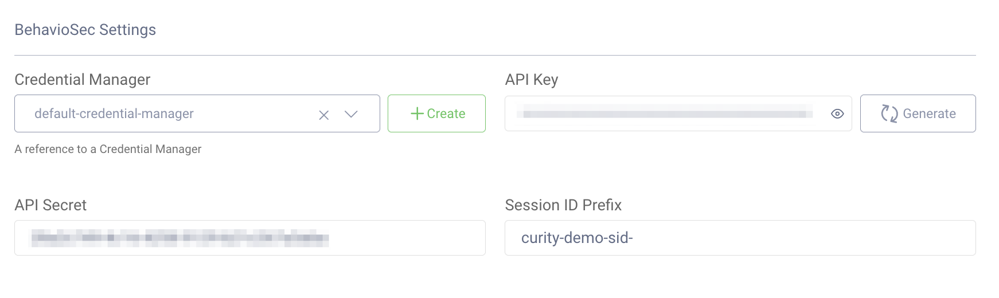
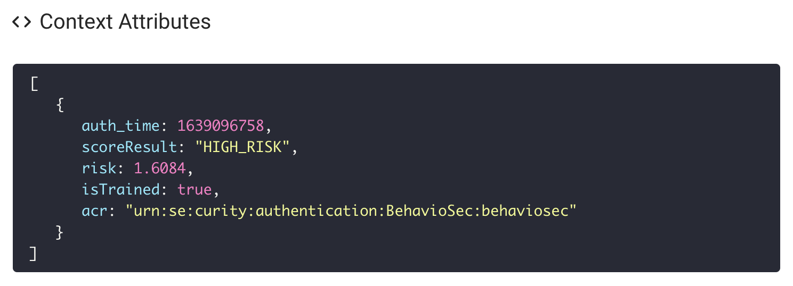
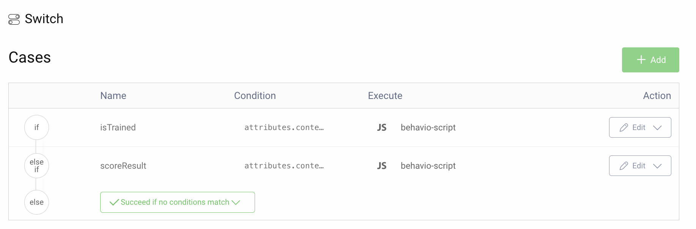
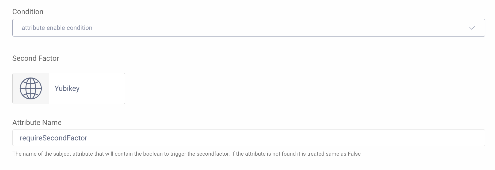

# BehavioSec Authenticator Plugin

[](https://curity.io/resources/code-examples/status/)
[](https://curity.io/resources/code-examples/status/)

A custom Authenticator plugin for the Curity Identity Server implementing behavioral data as a factor of authentication.

## Overview
[BehavioSec](https://www.behaviosec.com/) provides a cloud based service that can provide risk metrics that are based on the users interactions and behaviors. It allows, in this case, the authenticator in the Curity Identity Server to determine if the user that is authenticating is actually who they claim to be based on the interaction with the keyboard as the username and password is entered.

This authenticator sends data captured from the authentication step to BehavioSec Cloud that will return a risk score that the Curity Identity Server can act upon. Typically, the risk score would be used by an Authentication Action to invoke an additional factor of authentication if the risk score is above a certain configurable threshold.

Initially, BehavioSec Cloud won't know the user and the user's behavior. During this initial phase, BehavioSec Cloud will learn the user’s typing behavior and create a profile for the user. After a few logins the user will be, what BehavioSec refers to as "trained".

The overall result of leveraging behavioral data during the authentication will be a significantly reduced step-up to Multi-Factor Authentication (MFA). MFA only needs to be enforced if there is a high risk based on the behavioral data whereas all other cases (low risk) would be handled just they were before.

## Prerequisites
* An instance of the Curity Identity Server. Follow the [getting started](https://curity.io/resources/getting-started/) guide to get up and running if needed.
* A [BehavioSec Cloud Account](https://cloud.behaviosec.com/dashboard/signup).

## Building the Plugin

You can build the plugin by issuing the command `mvn package`. This will produce a JAR file along with the needed dependencies in the `target` directory, which can be installed.

## Installing the Plugin

To install the plugin, copy the compiled JAR (and all of its dependencies) into the :file:`${IDSVR_HOME}/usr/share/plugins/${pluginGroup}` on each node, including the admin node. For more information about installing plugins, refer to the [curity.io/plugins](https://support.curity.io/docs/latest/developer-guide/plugins/index.html#plugin-installation).

The plugin uses templates and localized messages for the front-end part of the authenticator. Deploy the template and messages by copying the following files:

* templates from the `resources/templates` directory to :file:`${IDSVR_HOME}/usr/share/templates/overrides/`
* messages from the `resources/messages` directory to :file:`${IDSVR_HOME}/usr/share/messages/overrides/`

Note that the path will depend on the name of the Authenticator configured in the Curity Identity Server. The example path in this folder structure assumes the name of the Authenticator is `behaviosec`.

### Update csp.vm
In order to allow the BehavioSec JS SDK to execute, `csp.vm` needs to be updated. The change needed is defined in `get.vm` but `scp.vm` needs to be updated to read that variable. Locate `csp.vm` in `idsvr/usr/share/templates/core/fragments/` and make the changes.

Add the following if/else statement after the ones that are already defined.

```js
#if(${_cspConnectSrc})
    #set ($connectSrc = ${_cspConnectSrc})
#else
    #set ($connectSrc = "connect-src 'self';")
#end
```

Then replace this row:
```js
<meta http-equiv="Content-Security-Policy" content="connect-src 'self'; font-src 'self'; $childSrc">
```

with this:
```js
<meta http-equiv="Content-Security-Policy" content="$!connectSrc font-src 'self';">
```

## Required Dependencies

For a list of the dependencies and their versions, run ``mvn dependency:list``. Ensure that all of these are installed in the plugin group; otherwise, they will not be accessible to this plug-in and run-time errors will result.

## Configuration

### Configuring the Authenticator

| Configuration      | Note                                                                         |
|--------------------|------------------------------------------------------------------------------|
| Credential Manager | A Credential Manager used for user credential verification.                  |
| API Key            | The BehavioSec Cloud API Key. This can be obtained from BehavioSec Cloud.    |
| API Secret         | The BehavioSec Cloud API Secret. This can be obtained from BehavioSec Cloud. |
| Session ID Prefix  | The prefix added to the BehavioSec sessions. Defaults to `curity-demo-sid-`. |

Screenshot from the Curity Identity Server Admin UI:



### Authentication Actions to Complete the Setup
This Authenticator returns 3 values from BehavioSec that are made available in the authentication attributes:

| Attribute     | Data Type | Example Value           |
|---------------|-----------|-------------------------|
| `isTrained`   | Boolean   | `true`, `false`         |
| `scoreResult` | Enum      | `HIGH_RISK`, `LOW_RISK` |
| `risk`        | Decimal   | `0.002`                 |

Here's an example of the attributes and values displayed by the [Debug Action](https://curity.io/docs/idsvr/latest/authentication-service-admin-guide/authentication-actions/debug-attribute.html).



The Curity Identity Server has Authentication Actions available out-of-the-box that can leverage these values. There are several ways to configure this. The below example uses a `switch` action to check the values of both `isTrained` and `scoreResult`. If the switch is triggered a `script` action is called that sets `requiredSecondFactor=true`. After that an MFA action is configured to invoke a configured second factor.

#### Switch Action
When the user is not trained it's a good idea to enforce some type of MFA. I.e., when `isTrained==false`.

When the user is trained but the `scoreResult` is anything other than `LOW_RISK`, MFA is also triggered. It would be possible to also the numerical value of `risk` instead for an even finer grained determination of when to trigger MFA.



The condition for `isTrained` is set to `attributes.context.isTrained === false`

The condition for `scoreResult` is set to `attributes.context.scoreResult != "LOW_RISK"`

#### Script Action

The script action is very simple and has one purpose only, to set the attribute `requireSecodFactor` to `true`.

```js
function result(transformationContext) {
    var attributes = transformationContext.attributeMap;
    attributes.requireSecondFactor = true;
    return attributes;
}
```

#### MFA Action

The MFA Action is triggered only when `requireSecondFactor` is set to `true`. In the below example the second factor is configured to be a WebAuthn Authenticator configured to use YubiKey.



## More Information

* Please visit [curity.io](https://curity.io/) for more information about the Curity Identity Server.
* Refer to the [BehavioSec Cloud Docs](https://cloud.behaviosec.com/docs) for more details on BehavioSec Cloud.

Copyright (C) 2021 Curity AB.
